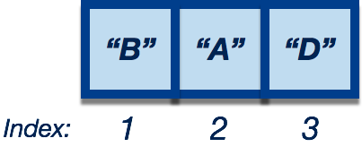
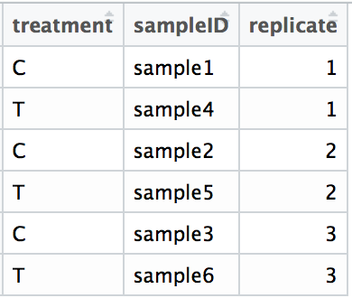

## Reordering data using indices
Often during data wrangling we find it necessary to reorder the elements in a vector or the rows or columns in a data frame. The most basic way to reorder is to use the indices associated with each element in a vector. Indexing `[ ]` can be used to extract values from a dataset, but it can also be used to rearrange the data values. 

```r
alphabet <- c("C", "F", "G", "A", "D", "E", "B")
```


We can extract values in a vector by specifying it's position or index:

```r
alphabet[c(7, 4, 5)] # Extracting values from a vector
alphabet
```


By specifying the element using it's index, we can extract the values from the vector in the order specified.



Therefore, to reorder values in a vector, we can extract **all of the values** and reorder them by providing the indices in the order we would like output. 


Let's reorder the elements to follow the order of the alphabet:

```r
alphabet[c(4, 7, 1, 5, 6, 2, 3)] 
```


If we want to save our results, we need to assign back to a variable:

```r
ordered_alphabet <- alphabet[c(4, 7, 1, 5, 6, 2, 3)] 
```
We use a similar strategy to reorder the rows or columns in a data frame. For instance with the following dataframe, `df`



To reorder the rows so that the sampleIDs are in numerical order, we can write the indices for the rows in the order we would like them to appear:

```r
df[c(1, 3, 5, 2, 4, 6), ]
```


To reorder the columns so that the `sampleID` column is the first followed by `treatment` and `replicate`, we can write the indices for the columns in the order we would like them to appear:

```r
df[ , c(2, 1, 3)]
```


There are functions to help with reordering data in alphabetical or numeric order, such as `order()`, `sort()`, and `arrange()`, among others. However, these functions will generally output the indices for reordering so that this step does not need to be done manually.
