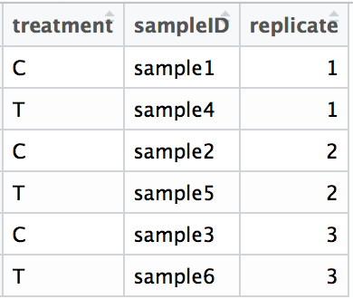

We can also reorder the rows or columns in data frames by specifying the order similar to ordering vectors. We will create a data frame to practice with:

```r
samples <- paste0("sample", 1:14)
treatment <- rep(alphabet, times = 2)
replicate <- rep(1:2, each = 7)
df <- data.frame(samples, treatment, replicate)
```



If we wanted to reorder the columns to make `replicate` come before `treatment`, we could use the same syntax as with vectors, but in two dimensions.

```r
df[indices of rows to extract, indices of cols to extract]
```

To extract the first and third rows:

```r
df[c(1,3), ]
```


To extract the second and third columns:

```r
df[ , c(2,3)]
```


To extract rows and columns:

```r
df[c(1,3), c(2,3)]
```


Now let's reorder our data frame to correspond to the alphabetical order of the treatment column. Note that we want to reorder the rows of our data frame, so we will use the row indexing:


```r
df[c(4, 11, 7, 14, 1, 8, 5, 12, 6, 13, 2, 9, 3, 10), ]
```